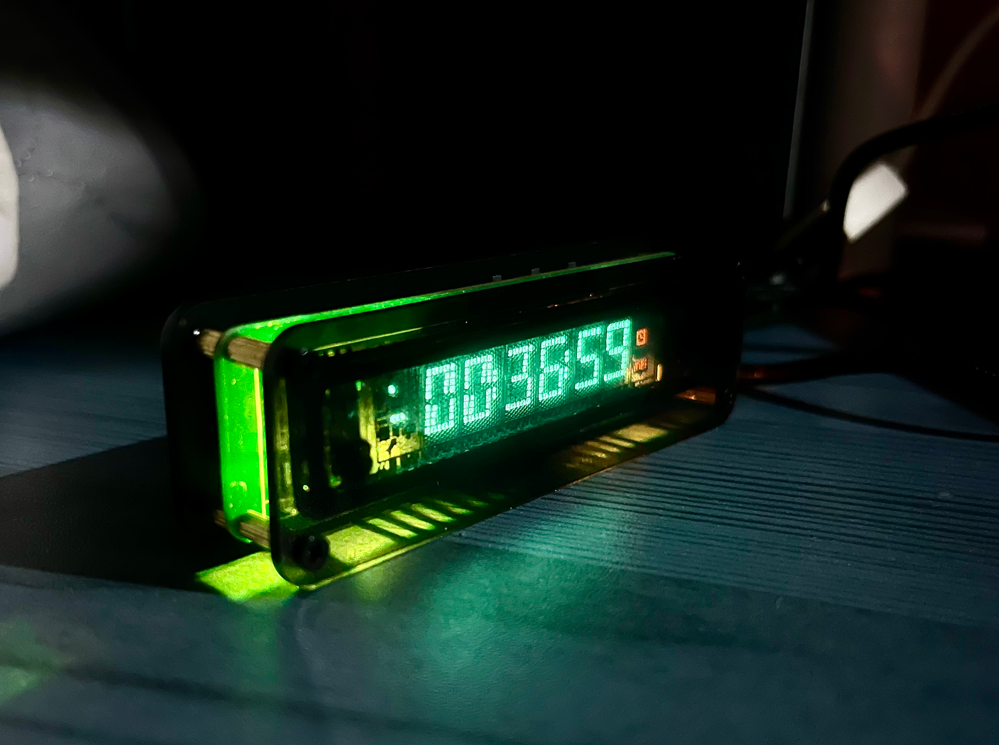
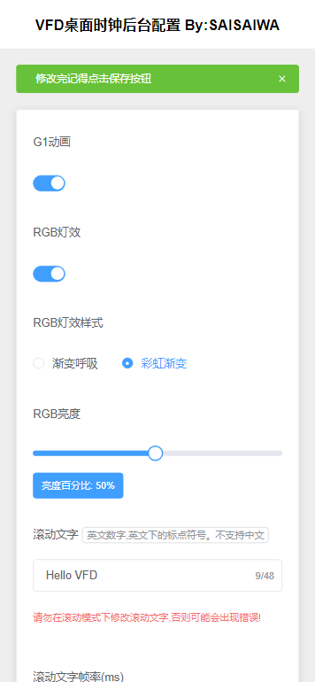

# CCY-VFD-7BT317NK
>  VFD屏幕7-BT-317NK驱动程序，主控ESP8266，驱动IC PT6315

Gitee国内同步仓库: https://gitee.com/Jack-chendeng/CCY-VFD-7BT317NK
Github仓库: https://github.com/ccy-studio/CCY-VFD-7BT317NK

开发环境：Arduino、PlatformIO

VFD驱动PT6315驱动程序，用于驱动自制VFD时钟项目。

主控ESP-12S安信可模块，集成WIFI配网自动校时为一体的桌面时间小制作。

博客： www.saisaiwa.com

VFD屏WIFI时钟硬件开源链接：http://www.saisaiwa.com/archives/vfd-clock-7-BT-317NK

VFD屏PT6315驱动时序：http://www.saisaiwa.com/archives/pt6315-code-jangj

交流群： http://www.saisaiwa.com/about

本项目是PlatformIO项目介于有些朋友电脑缺失环境或者网络原因一直卡着无法完成安装的原因，这里提供一个云编译的方法。此方法使用云端Docker容器借助云环境可以实现快速编译出所需要的.bin烧录文件。 
具体操作教程请看：http://www.saisaiwa.com/archives/1691566266606


用户手册：http://www.saisaiwa.com/archives/vfd-clock-userdescription

doc 文件夹下有所需要的一些资料文件。




``V3版本图``


## 1. 版本迭代记录

### V3版 - latest

#### future 3.0  (开发中)

- 新增WEB管理端页面
  - 内置WebServer服务，80端口
  - 添加HTML页面代码 （非本地JS、CSS文件需要WIFI可以联网）
  - 前后端分离设计
- 增加RGB灯效模块
- 增加无源蜂鸣器模块
- 代码大重构，优化稳定性
- 自动开关机
- 闹钟功能
- 计时器功能
- 按键可控制WIFI开关(长按+键等待1秒接住按下-键) 双向循环切换
- FN键新增展示当前WIFI的IP地址页面的切换(按下顺序切换)
- 联网对时增加自动间隔与首次获取时间配置
- 滚动文字可动态修改
- 滚动文字帧率可动态修改
- RBG新增3种特效
- RBG亮度可动态调整
- RBG可配置开关
- G1动画动态配置开关
- 存储模块 LittleFS文件存储





### V1板

https://oshwhub.com/yc_chen/vfd-317nk-qu-dong-ban

####  release - 1.0

- WIFI配网
- 联网校时
- 按键切换显示Style与内容

操作方式

- 短按按键1，开关LED
- 长按按键1两秒后松开，重置WIFI并会自动重启
- 短按按键2，亮度增加
- 短按按键3，亮度减少

####  release - 1.1 (20230812)

新增功能
- 长文字滚动显示
- 长文字循环轮播
- 添加G1段动画效果
- 重构字库逻辑
- 新增更多ASCII字库支持
- 优化稳定性

---

### V2板
https://oshwhub.com/yc_chen/v2-vfd-7-bt-317nk-wifi-shi-zhong

####  release-v2.0

新增功能
- 长文字滚动显示
- 长文字循环轮播
- 添加G1段动画效果
- 重构字库逻辑
- 新增更多ASCII字库支持
- 优化稳定性
- V2新版电路专用PWM支持


首次烧录程序会让你配网，默认会打开AP热点并显示(ap-run)，手机搜索热点``VFD-``开头的没有密码直接连接，按理正常会弹出配网的界面。
如果没弹出界面，那么请在浏览器输入``192.168.4.1``进行配网。
配网成功后会自动连接WIFI然后重启，如果配网失败会重启并重新开启AP热点。
如果在配网状态下长时间没有操作，系统将会超时进入死循环，屏幕会显示error信息。这个时候请手动重启。

### 2. 驱动库使用步骤

1. 首先您需要引入库文件

   ```c
   #include <gui.h>
   ```

2. 在Main方法初始化中Setup方法初始化

   ```c
   // 初始化VFD
   ptInitGPIO();
   delay(3000);
   vfd_gui_init();
   ```

API GUI操作方法

```c

/**
 * 初始化
 */
void vfd_gui_init();

/**
 * 停止关闭显示、灯丝将停止驱动
 */
void vfd_gui_stop();

/**
 * 清空VFD屏幕显示,循环刷新如果使用vfd_gui_set_text方法不需要使用它。
 */
void vfd_gui_clear();

/**
 * 在指定位置显示一个char字符,index从1~6
 */
void vfd_gui_set_one_text(size_t index, char oneChar);

/**
 * 显示一串文字，从0位开始。
 * (自动清空覆盖显示，方便每次不用调用clear防止闪屏出现)
 */
u8 vfd_gui_set_text(const char* string);

/**
 * 要点亮的ICON图标，宏定义传参
 * @param is_save_state 是否保存本次ICON图标到变量中
 */
void vfd_gui_set_icon(u32 buf, u8 is_save_state = 1);

/**
 * 获取保存的icon图标
 */
u32 vfd_gui_get_save_icon(void);

/**
 * 背光开关
 */
void vfd_gui_set_bck(u8 onOff);

/**
 * 设置亮度等级 1~7
 */
void vfd_gui_set_blk_level(size_t level);

/**
 * 第一位冒号，参数bool类型
 */
void vfd_gui_set_maohao1(u8 open);

/**
 * 第二位冒号，参数bool类型
 */
void vfd_gui_set_maohao2(u8 open);

/**
 * 循环滚动展示所有文字,可显示任意长字符内容
 * @param string 要展示的内容字符串
 * @param delay_ms 循环展示刷新频率单位 Ms
 * @param loop_count 循环播放的次数
 **/
void vfd_gui_set_long_text(const char* string, u32 delay_ms, size_t loop_count);
/**
 * 如果调用vfd_gui_set_long_text有存在循环播放未结束的调用此方法将会强制结束
 */
void vfd_gui_cancel_long_text();

/**
 * 获取字库值，内部用
 */
u32 gui_get_font(char c);

/**
 * G1动画特效
 * @param isAuto 是否自动完成触发
 * 1自动循环执行播放,0.外部给时钟触发(方法调用一次执行动画一帧)
 */
void vfd_gui_anno_for_g1(u8 isAuto = 1);
```


## 版权声明

本源代码的版权归 [saisaiwa] 所有。

未经版权所有者明确授权，不得将本代码的任何部分用于商业用途，包括但不限于出售、出租、许可或发布。

仅限个人学习、研究、非盈利性用途下使用。如果您有其他用途的需求，请联系 [yustart@foxmail.com] 进行授权。

在遵循以下条件的情况下，您可以自由修改、使用和分发本代码：

您必须保留此版权声明的所有内容。

您不得用于任何违法、滥用、恶意的活动。

您的使用不应损害任何个人、组织或作者的声誉。

作者不承担因使用本代码而产生的任何担保责任。作者对因使用本代码所导致的任何直接或间接损失不承担责任。

Github: https://github.com/ccy-studio/CCY-VFD-7BT317NK